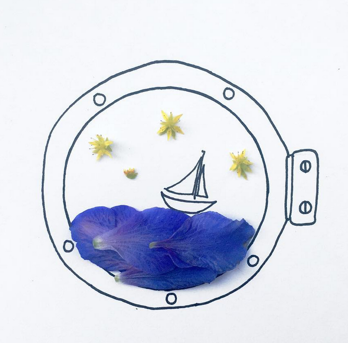
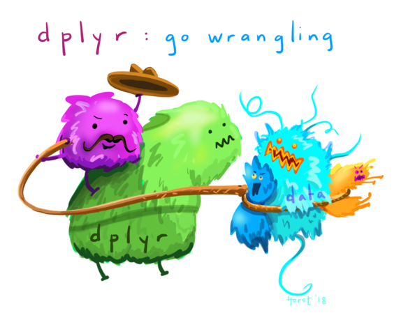
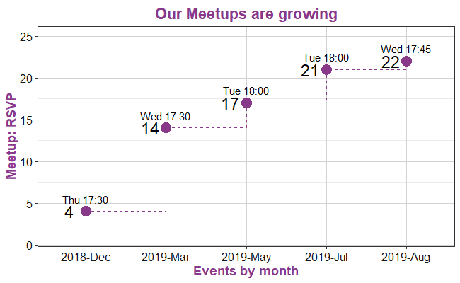
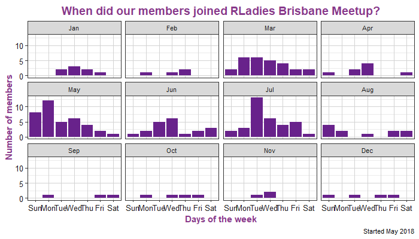

```{r setup, include=FALSE}
options(htmltools.dir.version = FALSE)
options(servr.daemon = TRUE)
```


background-image: url(https://upload.wikimedia.org/wikipedia/commons/b/be/Sharingan_triple.svg)
background-size: 100px
background-position: 90% 8%

# Sharingan

<br>
The R package name **xaringan** was derived from **Sharingan**, a dōjutsu in the Japanese anime _Naruto_ 

with two abilities:

--

- the "Eye of Insight"

- the "Eye of Hypnotism"

--

<br>

"I think a presentation is basically a way to communicate insights to the audience, and a great presentation may even "hypnotize" the audience." - by Yihui Xie.

---

class: middle center bg-main1

# Kunoichi
#⚔
#くノ一
# 女

--
## The Japanese word for female ninja

--


---

class: middle 

## Now Kunoichi is a theme of latest version of `xaringan`


---

class: inverse, center, middle bg-main1

# Get Started

---

# Let's do this together 

<br>
Install the **xaringan** package from **GitHub** 
```{r echo=FALSE, eval=TRUE}
anicon::faa('github', animate='float', rtext='@yihui')
```
[https://github.com/yihui/xaringan](https://github.com/yihui/xaringan)
  
<br>  
```{r eval=FALSE}
devtools::install_github("yihui/xaringan")
```
<br><br>
Thank you **Yihui Xie**
```{r echo=FALSE, eval=TRUE}
anicon::faa('twitter', animate='float', rtext='@xieyihui')
```
<br>
[https://twitter.com/xieyihui](https://twitter.com/xieyihui)


---
class: split-three

.row.bg-white[.content[

# Create a new R markdown file

  You are recommended to use the [RStudio IDE](https://www.rstudio.com/products/rstudio/).

```
      1. New Project
      2. From the menu: File > New File > R Markdown > Template > From Template > Ninja presentation
```      

]]
.row.bg-gray100[.content[
### then add/modify the YAML

```
      output:
        xaringan::moon_reader:
          css: ["kunoichi", "ninjutsu" "rladies-fonts"]
```
]]
.row.bg-main1[.content[
<br>
Thank you **Emi Tanaka** 
```{r echo=FALSE, eval=TRUE}
anicon::faa('twitter', animate='float', rtext='@statsgen')

anicon::faa('github', animate='float', rtext='emitanaka')
```
<br>
<br>
Thank you **Alison Hill** 
```{r echo=FALSE, eval=TRUE}
anicon::faa('twitter', animate='float', rtext='@apreshill')
anicon::faa('github', animate='float', rtext='@apreshill')
```
]]

---
class: middle center bg-main1

# YAY!! 
## that's pretty much it!


---
## To see results
<br>
- Click the **Knit** button to compile it; in other words to generate the HTML from Markdown.

<br>
- or use the [RStudio Addin](https://rstudio.github.io/rstudioaddins/) "Infinite Moon Reader" to live preview the slides (every time you update and save the Rmd document, the slides will be automatically reloaded in RStudio Viewer.
With this option it is recomended to use 
<br>
` r options(servr.daemon = TRUE)`
<br>
To avoid locking up your console while compiling. I added this to the Rmd.

---

# Other recommended reading 


1. The [remark.js](https://remarkjs.com) library; a simple, in-browser, Markdown-driven slideshow tool.

1. The [**xaringan**](https://github.com/yihui/xaringan) package to create R markdown presentations, from Yihui Xie.

1. The [**kunoichi**](https://github.com/emitanaka/ninja-theme) theme to add R-ladies flavour to your presentation, from Emi Tanaka.

1. [Rladies theme and fonts](https://alison.rbind.io/post/2017-12-18-r-ladies-presentation-ninja/) from Alison Hill.

---
class: middle center bg-main1

# Extras

---
class: split-two white

.column.bg-white[.content[


]]

.column.bg-main1[.content.vmiddle.center[
```{r echo=FALSE, eval=TRUE}
anicon::faa('instagram', animate='float', rtext='dcossyle')
```
<br>
[https://www.instagram.com/dcossyle/](https://www.instagram.com/dcossyle/) 
<br>
```{r echo=FALSE, eval=TRUE}
anicon::faa('twitter', animate='float', rtext='dcossyle')
```
```{r echo=FALSE, eval=TRUE}
anicon::faa('github', animate='float', rtext='dcossyleon')
```
<br>
* look for cute giraffes
<br>
[https://tinystats.github.io/teacups-giraffes-and-statistics/index.html](https://tinystats.github.io/teacups-giraffes-and-statistics/index.html)
]]

---

class: middle center



```{r echo=FALSE, eval=TRUE}
anicon::faa('github', animate='float', rtext='allisonhorst')
```
[https://github.com/allisonhorst/stats-illustrations](https://github.com/allisonhorst/stats-illustrations)


---

# Tables

If you want to generate a table, you can do something like this:
```{r echo=FALSE, eval=TRUE}
events <- read.csv("data/events-rladies-brisbane.csv")
```
### R-Ladies Brisbane events so far

```{r eval=require('DT')}
DT::datatable(events[,c(1,2,6,7)], fillContainer = FALSE)
```

---

class: middle center



See `scripts/01_rladiesBrisbane.R`
---


class: middle center



See `scripts/01_rladiesBrisbane.R`
---

class: middle center bg-main1


# Thanks!

Slides created via the R package **xaringan** [https://github.com/yihui/xaringan](https://github.com/yihui/xaringan)
<br>
and the theme **Kunichio** [https://github.com/emitanaka/ninja-theme](https://github.com/emitanaka/ninja-theme).
<br><br>
Jumping emogies optional from **anicon** 
[https://github.com/emitanaka/anicon](https://github.com/emitanaka/anicon).
<br><br>
Xaringan uses **remark.js** [https://remarkjs.com](https://remarkjs.com), **knitr**[http://yihui.name/knitr](http://yihui.name/knitr), and R Markdown [https://rmarkdown.rstudio.com](https://rmarkdown.rstudio.com).
<br><br>
I've used a lot of data wrangling and googling, and was inspired by many **RLadies** .

